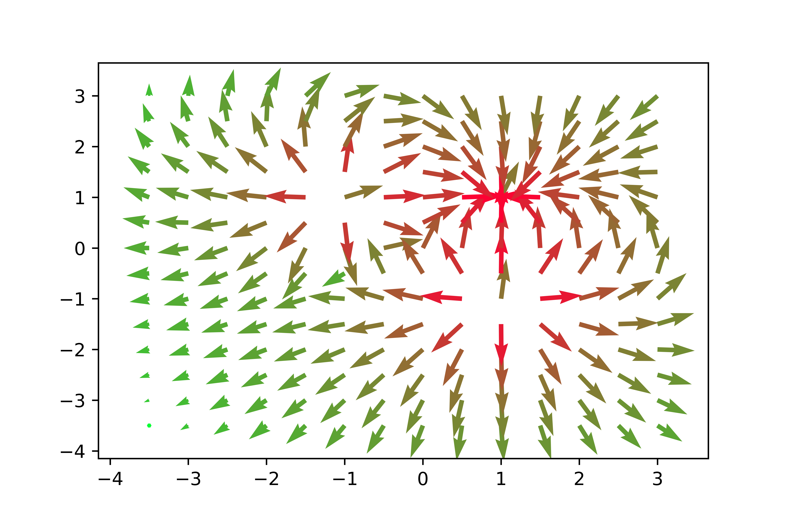

# Documentación del Proyecto de Cargas Eléctricas

Este proyecto consiste en una serie de clases de Python que permiten modelar y visualizar las interacciones entre cargas eléctricas y puntos en un plano cartesiano.

## Clases

El proyecto consta de las siguientes clases:

- `Carga`: Representa una carga eléctrica en un plano cartesiano. Tiene tres atributos principales: `cordenadaX`, `CordenadaY` y `cantidadCarga`, que representan la posición de la carga en el eje X, la posición de la carga en el eje Y y la cantidad de carga, respectivamente.

- `Punto`: Representa un punto en un plano cartesiano que puede interactuar con cargas eléctricas. Tiene varios atributos, incluyendo `cordenadaX`, `CordenadaY`, `ModuloFuerza` y `fuerzasSobreElPunto`, que representan la posición del punto en el eje X, la posición del punto en el eje Y, el módulo de la fuerza y las fuerzas sobre el punto, respectivamente.

- `Graficador`: Se utiliza para visualizar las interacciones entre los puntos y las cargas en un plano cartesiano. Puede calcular la norma de un vector, dibujar vectores para una lista de puntos y guardar la figura resultante.

- `creadorCarpetas`: Se utiliza para crear carpetas y archivos CSV que contienen datos sobre puntos y sus interacciones con cargas eléctricas. Puede crear una carpeta, crear un archivo CSV con los datos de una lista de puntos y guardar estos datos en un archivo.

- `plano`: Se utiliza para representar un plano cartesiano que contiene cargas eléctricas y puntos. Puede calcular las distancias máximas y mínimas en un eje, crear una matriz de puntos que rodean las cargas, graficar los puntos y guardar los datos e imágenes resultantes.
  
`graficarPuntos`: Uno de los métodos más importantes de la clase `plano` es `graficarPuntos`. Este toma cuatro argumentos para poder personalizar la gráfica: `norma`, que es un multiplicador para la norma del vector, esto se muestra en la gráfica con vectores más largos; `escala`, que es la proporción entre unidades numéricas y su representación gráfica, por ejemplo, si `escala` es 5, entonces una flecha de longitud 1 en el gráfico representa 5 unidades de los datos; `margenes`, que es un valor entre 0 y 1 que simboliza el porcentaje del gráfico que no tiene `Puntos` que se muestra; y por último tenemos `porFuera`, que es un valor entre 0 y 1 que simboliza el porcentaje del gráfico que pintará puntos alejándose de las cargas, siendo 0, que los puntos se dejan de dibujar justo en las cargas."

## Uso

Aquí hay un ejemplo de cómo podrías usar estas clases:

```python
# Importar las clases necesarias
from clasePunto import Punto
from claseCarga import Carga
from claseGraficador import Graficador
from Plano import plano

# Crear una instancia de la clase Carga
mi_carga = Carga(1.0, 2.0, 3.0)

# Crear una instancia de la clase Punto
mi_punto = Punto(4.0, 5.0)

# Guardar la fuerza ejercida por la carga sobre el punto
mi_punto.guardarFuerza(mi_carga)

# Crear una lista de puntos
lista_puntos = [mi_punto]

# Crear una instancia de la clase plano
mi_plano = plano(lista_cargas, espaciado=1.0)

# Graficar los puntos
mi_plano.graficarPuntos(norma=1.0, escala=20, margenes=1, porFuera=6)

# Guardar los datos e imagen
mi_plano.guardarDatosEimagen("nombre_de_la_carpeta")
```

Cuando ejecutas este script, realiza las siguientes acciones:

1. Crea varias cargas eléctricas en diferentes posiciones con diferentes cantidades de carga.
2. Crea un plano con las cargas creadas y un espaciado específico.
3. Grafica los puntos que rodean las cargas en el plano.
4. Guarda los datos e imágenes resultantes en una carpeta con un nombre específico.
5. Muestra el gráfico.
   <div style="text-align:center">

  
</div>

## Contribuir

Las contribuciones son bienvenidas. Por favor, abre un problema o solicita una extracción para cualquier contribución.

## Contacto

Si tienes alguna pregunta o sugerencia, por favor abre un problema en GitHub. Estaremos encantados de ayudarte. 😊
